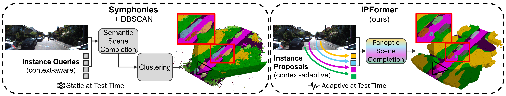

<div align="center">

# IPFormer: Visual 3D Panoptic Scene Completion with Context-Adaptive Instance Proposals


[Markus Gross](https://markus-42.github.io/)<sup>1,2,<a href="mailto:markus.gross@tum.de?subject=IPFormer" style="color: #4799e0; text-decoration: underline;">📧</a></sup>,&nbsp;
[Aya Fahmy](https://www.linkedin.com/in/aya-fahmy-7373441bb/)<sup>1</sup>,&nbsp;
[Danit Niwattananan](https://www.linkedin.com/in/danit-niwattananan-50b4321a6/)<sup>2</sup>,&nbsp;
[Dominik Muhle](https://dominikmuhle.github.io/)<sup>2</sup>,&nbsp;
[Rui Song](https://rruisong.github.io/)<sup>1,2</sup>,&nbsp;
[Daniel Cremers](https://cvg.cit.tum.de/members/cremers/) <sup>2</sup>,&nbsp;
[Henri Meeß](https://scholar.google.com/citations?user=7Qdm9jUAAAAJ&hl=en)<sup>1</sup>

<sup>1</sup> [Fraunhofer IVI](https://www.ivi.fraunhofer.de/en/research-fields/advanced-air-mobility/autonomous-flying.html),&nbsp;&nbsp;&nbsp;&nbsp;&nbsp;
<sup>2</sup>
[TU Munich](https://www.cit.tum.de/en/cit/home/)

<i><span style="color: magenta;">Neural Information Processing Systems (NeurIPS) 2025</span></i>

[](https://markus-42.github.io/publications/2025/ipformer/)&nbsp;&nbsp;
[](https://arxiv.org/abs/2506.20671)&nbsp;&nbsp;
[](https://neurips.cc/virtual/2025/poster/117455)


</div>

## 🚀 News
- **[2025/11]:** Code released
- **[2025/10]:** [Project page](https://markus-42.github.io/publications/2025/ipformer/) online
- **[2025/09]:** IPFormer accepted at NeurIPS 2025
- **[2025/06]:** [Paper](https://arxiv.org/abs/2506.20671) preprint available on arXiv

---

## 💡 Introduction

We present IPFormer, the first method that leverages context-adaptive **instance proposals** at train and test time to address vision-based 3D Panoptic Scene Completion.
Recent Transformer-based 3D vision approaches like [DETR](https://github.com/facebookresearch/detr) or [Symphonies](https://github.com/hustvl/Symphonies?tab=readme-ov-file) utilize a fixed set of learned queries to represent objects within the scene volume.
Although these queries are typically updated with image context during training, they remain static at test time, limiting their ability to dynamically adapt specifically to the observed scene.
To overcome this limitation, IPFormer initializes these static, non-adaptiv queries as instance proposals, which are adaptively derived from image context at both train and test time.
Extensive experimental results show that our method achieves state-of-the-art in-domain performance, exhibits superior zero-shot generalization on out-of-domain data, and offers a runtime reduction exceeding 14x. Check the [IPFormer YouTube Video](https://youtu.be/KlXAvp-mIU4?si=D6bFq7AUOE7Gwk9i) for full explanation incl. audio.

<div align="center">



</div>

---

## ⚙️ Environment Setup

### 1. Setup Script

Follow [install.md](%20install.md)

## 📁 Datasets

- [SemanticKITTI](http://www.semantic-kitti.org/) for training
- [SSCBench-KITTI-360](https://github.com/ai4ce/SSCBench/tree/main/dataset/KITTI-360) for zero-shot generalization evaluation

Follow [dataset.md](dataset.md) to process and structure them correctly.

---

## 📋 Download Checkpoints

We use three pretrained models:
1. [MobileStereoNetV2](https://github.com/cogsys-tuebingen/mobilestereonet) depth estimation model used for lifting 2D to 3D
2. [EfficientNet](https://arxiv.org/abs/1905.11946) image backbone for image feature extraction
3. [CGFormer](https://github.com/pkqbajng/CGFormer)'s pretrained depth refinement module

Create the necessary directories and get the checkpoints as follows:

```bash
# Create required folders
mkdir pretrain
mkdir ckpts

# Depth refinement module
cd pretrain
wget https://github.com/markus-42/IPFormer/releases/download/v1.0.0/pretrain_geodepth.pth
# Image backbone and geodepth weights
cd ckpts
wget https://github.com/markus-42/IPFormer/releases/download/v1.0.0/efficientnet-b7_3rdparty_8xb32-aa_in1k_20220119-bf03951c.pth
wget https://github.com/markus-42/IPFormer/releases/download/v1.0.0/swin_tiny_patch4_window7_224.pth

wget https://github.com/markus-42/IPFormer/releases/download/v1.0.0/ipformer_semkitti_v1.0.0.part_aa
wget https://github.com/markus-42/IPFormer/releases/download/v1.0.0/ipformer_semkitti_v1.0.0.part_ab
cat ipformer_semkitti_v1.0.0.part_* > ipformer_semkitti.ckpt

```

---

## 💪 Training

Our framework follows a dual-head, two-stage pipeline: The first stage and its corresponding head addresses **Semantic Scene Completion (SSC)**, effectively guiding the latent space towards geometry and semantics. The second training stage and its corresponging head registers individual instances, addressing full **Panoptic Scene Completion (PSC)**.

First, run **Stage 1 (SSC-only)** to pretrain the semantic branch:

```bash
python train_stage1.py \
  --config_path ./configs/IPFormer_config.py \
  --log_folder IPFormer_SemanticKITTI \
  --seed 7240 \
  --log_every_n_steps 100

```

After Stage 1 finishes and the checkpoint is saved, continue with **Stage 2 (full PSC)**:

```bash
python train_stage2.py \
  --config_path ./configs/IPFormer_config.py \
  --log_folder IPFormer_SemanticKITTI \
  --seed 7240 \
  --log_every_n_steps 100
```

---

## 🔢 Evaluation

To evaluate a trained checkpoint directly:

```bash
python eval.py \
  --config_path ./configs/IPFormer_config.py \
  --ckpt_path ./ckpts/ipformer_semkitti.ckpt \
  --output_dir ./outputs/
  --measure_time
```

---


## 🙏 Acknowledgements

We build upon and thank the following projects:

- [CGFormer](https://github.com/pkqbajng/CGFormer)
- [PaSCo](https://github.com/astra-vision/PaSCo)
- [VoxFormer](https://github.com/NVlabs/VoxFormer)
- [BEVFormer](https://github.com/fundamentalvision/BEVFormer)
- [MonoScene](https://github.com/astra-vision/MonoScene)
- [MobileStereoNet](https://github.com/cogsys-tuebingen/mobilestereonet)
- [mmdet3d](https://github.com/open-mmlab/mmdetection3d)
- [semantic-kitti-api](https://github.com/PRBonn/semantic-kitti-api)
- [EfficientNet](https://arxiv.org/abs/1905.11946)

If your work has been missed, please contact us and we will be happy to include it.

---

## 📜 Citation

If IPFormer has contributed to your work, we would appreciate citing our paper and giving the repository a star.

```
@inproceedings{gross2025ipformer,
  title={{IPF}ormer: Visual 3D Panoptic Scene Completion with Context-Adaptive Instance Proposals},
  author={Markus Gross and Aya Fahmy and Danit Niwattananan and Dominik Muhle and Rui Song and Daniel Cremers and Henri Meeß},
  booktitle={The Thirty-ninth Annual Conference on Neural Information Processing Systems (NeurIPS)},
  year={2025}
  }
``` 

